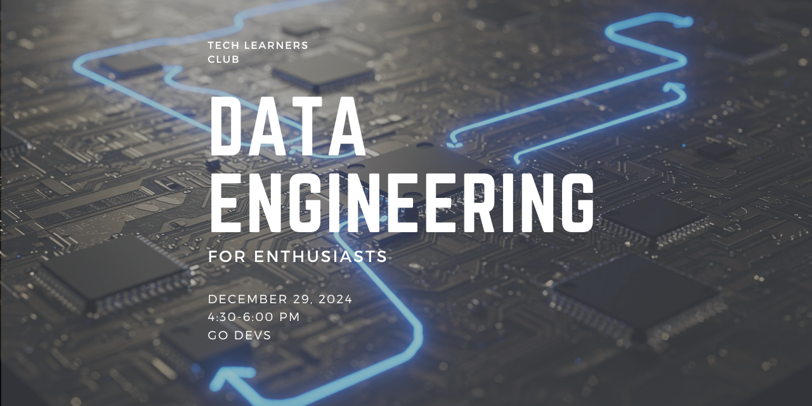

  

# Data Engineering Camp
Welcome to Data Engineering Camp — a hands-on, practical course designed to build real-world data engineering skills step by step.

This repository follows a learn-by-building approach, where each module focuses on a core component of modern data engineering systems such as containers, databases, infrastructure, and cloud-native tooling.

The goal of this camp is not just to teach tools, but to help you think like a data engineer:
- How data flows through systems
- How infrastructure is designed and automated
- How reliability, scalability, and cost are handled in practice

This course is ideal for:
- Beginners entering Data Engineering
- Software engineers transitioning into data roles
- Anyone who wants strong foundations in modern data platforms

# Index
| Module | Topic | Description | Folder |
|--------|-------|-------------|--------|
| 01 | Docker | Containerization fundamentals for data engineering, running services locally | 01-Docker/ |
| 02 | PostgreSQL | Relational database concepts, schema design, ingestion & querying | 02-postgres/ |
| 03 | Terraform | Infrastructure as Code, AWS basics, and building a data lake | 04-Terraform/ |
